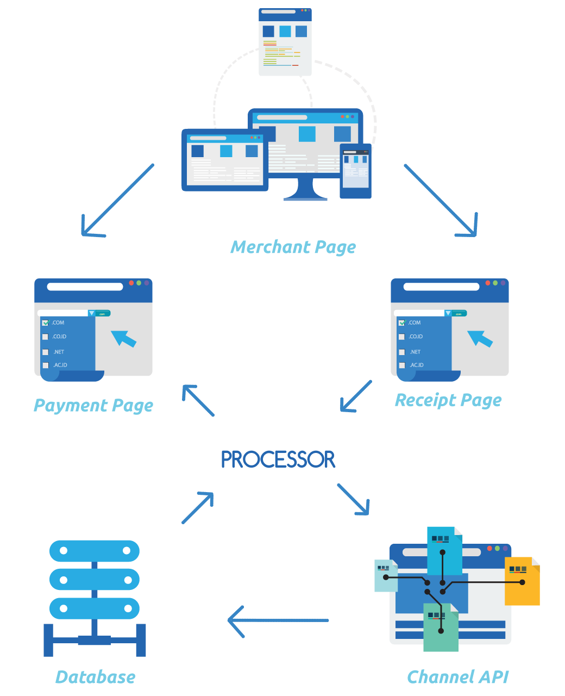

# Introduction

BayoPay is a product by [Bayo Pay (M) Sdn Bhd](http://bayo.my), a company that is focusing on online / offline payment solutions. We aim to be a market leader as a Payment Facilitator on payment methods in Malaysia and globally.

## How Does It Works?

BayoPay is a service that helps merchant to sell online and expand rapidly to South-East Asia market. The service includes:


### Frontend
- RWD or responsive web design payment page for online buyer to checkout.
- Channel switching is available for same currency channels.
- Common shopping carts payment module, plugin, add-on, or extension supported.

### Backend
- Callback to update merchant system on deferred status change.
- Merchant can login to control panel to track payment status.
- Scheduled report on daily / weekly / monthly basis to update merchant via email.
- Real-time visualize reports.

# Payment Flow Overview

BayoPay provides hosted payment page service. The integration is as simple as passing parameters via HTTPS POST method from merchant to BayoPay payment page. Buyer will proceed their transaction on internet banking or any payment channel. Once completed, BayoPay will redirect buyer’s front-end back to merchant  system,  using  POST  method.  IPN (Instant Payment Notification) or ACK from merchant could be implemented to confirm the receiving of payment status update.



## Handling Payment Notification

Merchant needs to prepare 3 simple and similar scripts to handle payment notification from BayoPay:

Script | Description
------ | -------
**Return URL** | For frontend or browser based notification, which are normally not a 100% reliable and robust channel due to unexpected network connectivity issue or client-side behaviour, such as browser application crash.
**Callback URL** | A special handler to get notified on non-realtime payment status, such as "deferred status update", change of payment status, or cash channel, which is not a real time payment naturally.

After the normal payment flow, merchant can always send payment status query request, which is defined in ReQuery APIs (a.k.a PSQ, Payment Status Query).

# Security & Data Integrity

BayoPay system uses “Niaga ID” & “Niaga Key” to generate encrypted hash to ensure data integrity in the payment process.

## Niaga Key

BayoPay Niaga Key is uniquely encrypted string for BayoPay merchants. It is a key or seed for generating one-time hash data, which are known as “bayo_reqhash” (from merchant to BayoPay) or “bayo_reshash” (from BayoPay to merchant).

> Example of how a Niaga Key looks like:

```php
dT3jajIO93GH9shja83jl9a9w9hdfHY5
```

### How to get the Niaga Key?
- Login to Bayopay Merchant Admin site.
- Go to Settings &rarr; Transaction Settings.
- Scroll down until you see "Niaga Key".
- Get the value and use it on any functions that require it.

<aside class="warning">
<code>dT3jajIO93GH9shja83jl9a9w9hdfHY5</code> is merchant’s Niaga Key provided by BayoPay. Please make sure it is at least 32 characters. Merchant or developer is advised not to disclose this secret key to the public. Once the key is compromised, please contact BayoPay immediately to reset the key.
</aside>

## Request Hash

BayoPay Request Hash or <code>bayo_reqhash</code> is to ensure the data integrity passed from merchant system to BayoPay payment page to avoid man-in-the-middle (MITM) attack. It becomes a mandatory for each transaction if “Enable Verify Payment” is activated in merchant profile as shown.

> Formula to generate bayo reqhash:

```php
$bayo_reqhash = hash(sha256, $niagaID + $currency + $orderID + $amount + $niaga_key);
```

<aside class="notice">
<code><span style="color: #272822">bayo_reqhash</span></code> is encrypted using <code><span style="color: #272822">SHA256</span></code> encryption hash function and consists of the following information (must be set in the following orders):
<ul>
<li>BayoPay Niaga ID</li>
<li>Currency</li>
<li>Merchant Order ID</li>
<li>Transaction Amount (With 2 decimal place and without thousand)</li>
</ul>
</aside>

## Response Hash

BayoPay bayo_reshash is a returning hash string to ensure the data integrity passed back from BayoPay to merchant system. Merchant MUST verify this hash string properly and also compare the order ID, currency, amount, and the payment date/time if possible, to protect self-interest from being cheated by hacker buyer. bayo_reshash was encrypted twice using sha256 encryption hash function and consists of the following information (must be set in the following orders):

### First hash string
- Transaction ID
- Order ID
- Status
- BayoPay Niaga ID
- Amount
- Currency

> Formula to generate bayo reshash:

```php
$bayo_reshash = hash(sha256, $bayo_tranID + $bayo_orderID + $bayo_status + $bayo_niagaID + $bayo_amount + $bayo_currency);
```


### Final hash string
- Payment Date/Time
- BayoPay Niaga ID
- First hash string
- Approval Code
- BayoPay Niaga Key

#Sandbox Account

#Payment APIs

## Initiating Payment

Passing parameters to BayoPay payment page using POST method via HTTPS or SSL
connection will initiate a payment request from merchant system.

## Payment URL

`https://gateway.bayo.my/bayoipg/Pays/index.php`

The URL is an API to accept POST parameters from merchant site as well as the payment
page for buyer.

## Channel Lists

Channel Name | Parameter Name | Accepted Currency | Processing Amount Limit (RM) | Extra Information
------------ | -------------- | ----------------- | ---------------------------- | -----------------
Visa / MasterCard | creditmc | USD | 1.00 > x < 5000.00 | Multi-currency credit channel

## Payment Page Integration

This is the traditional integration method which will send the buyer information to BayoPay payment page.

<aside class="notice">
We provided an example of integrating your payment page / checkout page to send the buyer payment straight to our payment page.
Please refer the <a href="#post-request-example"><code>POST Request Example</code></a> section.
</aside>

## Request Parameters 

These parameters can be passed using either POST method. Please use UTF-8 encoding for all values.

Variable / Parameter | Type Format / Max Length | Description / Example
-------------------- | ------------------------ | ---------------------
<code>bayo_niagaid</code> | Mandatory, Alphanumeric. | Niaga ID provided by BayoPay
<code>bayo_currency</code> | Mandatory, 3 chars ISO- 4217 currency code. | Default payment currency from merchant site. E.g. MYR, USD, EUR SGD, CNY, IDR
<code>bayo_amount</code> | Mandatory, Decimal with 2 decimal points and without thousand separator. | The total amount to be paid in one purchase order. Configurable to lock this field (Read-only). E.g. 500, 168.99
<code>bayo_orderid</code> | Mandatory, Alphanumeric up to 32 characters. | Invoice or order number from merchant system. Can set to Read-only field. E.g. BH2018-09rev
<code>bayo_name</code> | Mandatory, Alphanumeric, 128 chars. | Buyer’s full name.
<code>bayo_email</code> | Mandatory, Email, 128 chars. | Buyer’s email address.
<code>bayo_mobile</code> | Mandatory, Alphanumeric, 32 chars. | Buyer’s mobile number or contact number.
<code>bayo_description</code> | Mandatory, Alphanumeric, 64kB. | Purchase itemized list or order description. Avoid special character so the request is not blocked by web application firewall.
<code>bayo_channel</code> | Mandatory, Predefined string. | Default payment page will be displayed. Refer to Channel Lists.
<code>bayo_returnurl </code> | Optional, URL.  | Used for multiple return URL. URLs must be registered beforehand with BayoPay.
<code>bayo_callbackurl</code> | Optional, URL. | Used for multiple callback URL. URLs must be registered beforehand with BayoPay.
<code>bayo_reqhash</code> | Mandatory. 32 chars hexadecimal string. | This is the data integrity protection hash string. Refer bayo_reqhash section for details.

## Getting Result

Payment result will be returned to merchant system once payment is done or user abandons the payment process. HTTP POST is the only method that BayoPay returns all parameters to merchant’s return URL for real time status update, which merchant can configure it in merchant admin.

<aside class="warning">
Merchant system should block all other methods or parameters from untrusted source.
</aside>

<!---
## Parameters

Variable / Parameter | Type Format / Max Length | Description / Example
-------------------- | ------------------------ | ---------------------
<code>bayo_amount</code> | 2 decimal points numeric value | The total amount paid.
<code>bayo_orderid</code> | Alphanumeric, 32 characters | Invoice or order number from merchant system.
<code>bayo_tranid</code> | Integer, 10 digits | Unique	transaction	ID	for	tracking purpose.
<code>bayo_niagaid</code> | Alphanumeric, 32 chars | Niaga ID in BayoPay system.
<code>bayo_status</code> | 2-digit numeric value | 00 for Successful payment, 11 for failure, 22 if pending.
<code>bayo_bankcode</code> | Integer, 3 digits |
<code>bayo_paymentcode</code> | |
<code>bayo_appcode</code> | Alphanumeric, 16 | Bank approval code. Mandatory for Credit Card. Certain channel returns empty value.
<code>bayo_errorcode</code> | Alphanumeric | Refer to the Error Codes section. 
<code>bayo_errordesc</code> | Text | Error message or description.
<code>bayo_currency</code> | 3 chars (ISO-4217) currency code | Default currency is MYR for Malaysia channels.
<code>bayo_channel</code> | Predefined string in BayoPay system | Channel references for merchant system.
<code>bayo_txndate</code> | Date/Time( YYYY-MMDD HH:mm:ss) | Date/Time of the transaction.
<code>bayo_reshash</code> | 32 chars hexadecimal string | This is the data integrity protection hash string. Refer bayo_reshash section for details.


Merchant is recommended to implement IPN (instant payment notification) in order to acknowledge (ACK) on the receiving of payment status from BayoPay. There are 2 ways to implement IPN. Please refer to IPN section for details.


## Status Notification
<aside class="warning">
WARNING : Please note that multiple payment notifications (either from return URL or callback URL) for single transaction is possible but this does not mean that the buyer has paid twice or multiple times.
</aside>

### IPN (Instant Payment Notification)

For normal payment flow, buyer’s browser is being redirected to BayoPay payment page, financial institution or channel page (if any), and then return to merchant website or system. User might close the browser any time throughout the payment process, even the payment is completed, successfully or failed. Other possible reason that rarely happens is the network connectivity issue. As a result, BayoPay is unable to update merchant system on the payment status. Therefore, merchant is recommended to implement IPN to acknowledge (ACK) upon the receiving of payment status from BayoPay. Otherwise BayoPay will resend the payment status within a time interval.
-->

## Callback Function

### Parameters

These parameters can be passed using either POST method. Please use UTF-8 encoding for all values.


Variable / Parameter | Type Format / Max Length | Description / Example
-------------------- | ------------------------ | ---------------------
<code>bayo_niagaid</code> | Mandatory, Alphanumeric. | The total amount paid.
<code>bayo_currency</code> | Mandatory, 3 chars ISO-4217 currency code. | Invoice or order number from merchant system.
<code>bayo_amount</code> | Mandatory, Decimal with 2 decimal points and without thousand separator. | Unique	transaction	ID	for	tracking purpose.
<code>bayo_orderid</code> | Mandatory, Alphanumeric up to 32 characters. | Invoice or order number from merchant system. Can set to Readonly field. E.g. BH2018-09rev.
<code>bayo_reqhash</code> | Mandatory. 32 chars hexadecimal string. | This is the data integrity protection hash string. Refer bayo_reqhash section for details.

## Response Sample

This is an example of response sent from our payment gateway:

> Response sample:

```json
{
    "bayo_amount":"90.00",
    "bayo _orderid":"1081699081", 
    "bayo _tranid":"TXN160001126",
    "bayo _niagaid":"100105000000203", 
    "bayo_status":"00", 
    "bayo_bankcode":"987", 
    "bayo_paymentcode":"500333284335", 
    "bayo_errorcode":null, 
    "bayo_errordesc":null, 
    "bayo_currency":"USD", 
    "bayo_channel":"artajasa", 
    "bayo_paydate":"2016-04-14 17:39:43",
    "bayo_reshash":"1dc05ab215e073e3900ef07a00841 3b5e233c1434c1 2eb235e549a4595ed1f28"
}
```

<aside class="notice">
Response from our API will always be returned in JSON.
</aside>

## Response Parameters

Variable / Parameter | Type Format / Max Length | Description / Example
-------------------- | ------------------------ | ---------------------
<code>bayo_amount</code> | 2 decimal points numeric value. | The total amount paid.
<code>bayo_orderid</code> | Alphanumeric, 32 characters. | Invoice or order number from merchant system.
<code>bayo_tranid</code> | Integer, 10 digits. | Unique	transaction	ID	for	tracking purpose.
<code>bayo_niagaid</code> | Alphanumeric, 32 chars. | Niaga ID in BayoPay system.
<code>bayo_status</code> | 2-digit numeric value | 00 for Successful payment, 11 for failure, 22 if pending.
<code>bayo_bankcode</code> | Integer, 3 digits | Buyer’s email address.
<code>bayo_paymentcode</code> | | Buyer’s mobile number or contact number.
<code>bayo_appcode</code> | Alphanumeric, 16 chars. | Bank approval code. Mandatory for Credit Card. Certain channel returns empty value.
<code>bayo_errorcode</code> | Alphanumeric. | Refer to the Error Codes section.
<code>bayo_errordesc</code> | Text. | Error message or description.
<code>bayo_currency</code> | 2 chars (ISO-4217) currency code. | Default currency is MYR for Malaysia channels.
<code>bayo_channel</code> | Predefined string in BayoPay system. | Channel references for merchant system.
<code>bayo_txndate</code> | Date / Time ( YYYY-MMDD HH:mm:ss) | Date / Time of the transaction.
<code>bayo_reshash</code> | 32 chars hexadecimal string. | This is the data integrity protection hash string. Refer bayo_reshash section for details.


## Error Code

The response codes in this section only apply to BayoPay transactions.

Error Code | Description
---------- | -----------
<code>BP00001</code> | Missing required parameters.
<code>BP00002</code> | Merchant info not found.
<code>BP00003</code> | Merchant account issue. Please contact merchant.
<code>BP00004</code> | System is busy now, temporary out of services. Please try later - txn blocked due to mass connection.
<code>BP00005</code> | Payment info incorrect - reqhash unmatch.
<code>BP00006</code> | This account doesn't authorize to use this channel - reqhash.
<code>BP00007</code> | Currency unsupported.
<code>BP00008</code> | Transaction amount must more than.
<code>BP00009</code> | Transaction amount must less than.
<code>BP00010</code> | Not allow to process.
<code>BP00011</code> | Your request is not valid - Processor gateway config not found.
<code>BP00012</code> | Your credit card number or expiration date is not valid.
<code>BP00013</code> | System is busy now, temporary out of services. Please try later - Insert transaction error.
<code>BP00014</code> | Payment timeout - Insert transaction error.
<code>BP00015</code> | Transaction info not found.
<code>BP00016</code> | Amount from bank do not match.
<code>BP00017</code> | Signature from bank not match.
<code>BP00018</code> | System is busy now, temporary out of services. Please try later - Update transaction status error.
<code>BP00019</code> | System is busy now, temporary out of services - Attempt to update non pending status.
<code>BP00020</code> | System is busy now, payment receipt cannot be shown. Please try later - openssl_decrypt failed.
<code>BP00021</code> | The system have detected that the your IP provided is blacklisted in the server.
<code>BP00022</code> | System is busy now, temporary out of services. Please try later - Update.
<code>BP00023</code> | Session ID from bank do not matchtransaction error.

## Currency Code

The currency codes in this section only apply to BayoPay transactions.

Code | Currency
---- | --------
<code>840</code> | <code>USD</code>
<code>458</code> | <code>MYR</code>
<code>360</code> | <code>IDR</code>

## POST Request Example

Here is an example on how to send a POST request to Bayo Payment Gateway.

```php
<?php
$bayo_payment_gateway_url = "https://gateway.bayo.my/bayoipg/Pays/index.php";
echo "<form action='<?=$bayo_payment_gateway_url ?>' method='post'>";
echo "<input type='hidden' name='bayo_niagaid' value='<?= $niagaID?>'>";
echo "<input type='hidden' name='bayo_channel' value='<?= $channel ?>'>"; 
echo "<input type='hidden' name='bayo_currency' value='<?= $currency ?>'>"; 
echo "<input type='hidden' name='bayo_orderid' value='<?= $orderid ?>'>"; 
echo "<input type='hidden' name='bayo_amount' value='<?= $amount ?>'>"; 
echo "<input type='hidden' name='bayo_name' value='<?= $name ?>'>";
echo "<input type='hidden' name='bayo_email' value='<?= $email ?>'>"; 
echo "<input type='hidden' name='bayo_mobile' value='<?= $mobile ?>'>"; 
echo "<input type='hidden' name='bayo_description' value='<?= $desc ?>'>"; 
echo "<input type='hidden' name='bayo_reqhash' value='<?= $hash ?>'>"; 
echo "<input type='submit' value='PAY NOW'>";
?>
```

<aside class="notice">
This example shows a <code>POST</code> request from merchant's checkout page. The request containing compulsory <code>POST</code> data or payload should be sent to our API.
</aside>